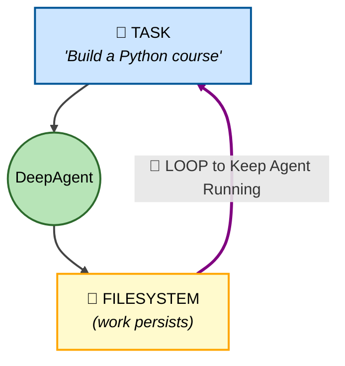
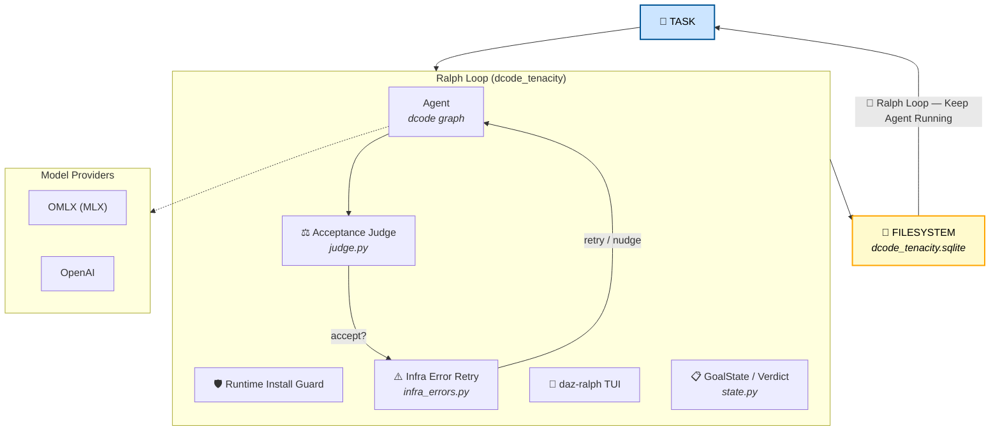

# Ralph Mode for DeepAgents — Architecture Diagrams

## Simple Loop (from screenshot)

```mermaid
flowchart TD
    classDef taskStyle fill:#cce5ff,stroke:#005596,stroke-width:2px,color:#000;
    classDef agentStyle fill:#b7e4b7,stroke:#2d6a2d,stroke-width:2px,color:#000;
    classDef fsStyle fill:#fffacd,stroke:#ffa500,stroke-width:2px,color:#000;

    TASK["🎯 TASK<br/><i>'Build a Python course'</i>"]
    AGENT(("DeepAgent"))
    FS["💾 FILESYSTEM<br/><i>(work persists)</i>"]

    TASK --> AGENT
    AGENT --> FS
    FS -->|"🔄 LOOP to Keep Agent Running"| TASK

    class TASK taskStyle;
    class AGENT agentStyle;
    class FS fsStyle;

    linkStyle 0 stroke:#444,stroke-width:2px;
    linkStyle 1 stroke:#444,stroke-width:2px;
    linkStyle 2 stroke:#800080,stroke-width:3px;
```

## Expanded Architecture — Inside the Ralph Loop

```mermaid
flowchart TD
    classDef taskStyle fill:#cce5ff,stroke:#005596,stroke-width:2px,color:#000;
    classDef agentStyle fill:#b7e4b7,stroke:#2d6a2d,stroke-width:2px,color:#000;
    classDef fsStyle fill:#fffacd,stroke:#ffa500,stroke-width:2px,color:#000;
    classDef ralphFill fill:#f3e5f5,stroke:#7b1fa2,stroke-width:2px,color:#000;
    classDef compFill fill:#e8e8e8,stroke:#666,stroke-width:1px,color:#333;
    classDef sandFill fill:#ffe0cc,stroke:#cc7000,stroke-width:1px,color:#333;
    classDef provFill fill:#d4f0e0,stroke:#2d6a2d,stroke-width:1px,color:#333;

    TASK["🎯 TASK"]
    FS["💾 FILESYSTEM<br/><i>dcode_tenacity.sqlite</i>"]

    subgraph RALPH["Ralph Loop (dcode_tenacity)"]
        AGENT["Agent<br/><i>dcode graph</i>"]
        JUDGE["⚖️ Acceptance Judge<br/><i>judge.py</i>"]
        GUARD["🛡️ Runtime Install Guard"]
        INFRA["⚠️ Infra Error Retry<br/><i>infra_errors.py</i>"]
        LAUNCHER["🚀 daz-ralph TUI"]
        STATE["📋 GoalState / Verdict<br/><i>state.py</i>"]

        AGENT --> JUDGE
        JUDGE -->|"accept?"| INFRA
        INFRA -->|"retry / nudge"| AGENT
    end

    subgraph PROVIDERS["Model Providers"]
        OMLX["OMLX (MLX)"]
        OPENAI["OpenAI"]
    end

    TASK --> RALPH
    RALPH --> FS
    FS -->|"🔄 Ralph Loop — Keep Agent Running"| TASK

    AGENT -.-> PROVIDERS

    class TASK taskStyle;
    class FS fsStyle;
    class OMLX,OPENAI provStyle;

    classDef ralphFill fill:#f3e5f5,stroke:#7b1fa2,stroke-width:2px,color:#000;
    classDef provFill fill:#d4f0e0,stroke:#2d6a2d,stroke-width:1px,color:#333;
```
